### 💻 `> neofetch --user profile`

<table border="0" cellpadding="0" cellspacing="0">
  <tr>
    <td valign="middle" align="center">
      
    </td>
    <td valign="top" align="center">
      
    </td>
  </tr>
</table>

 

### 📊 `> gh stats --contributions`

